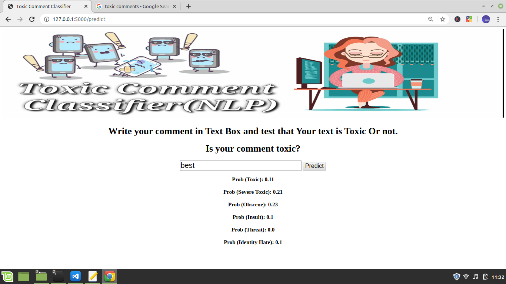
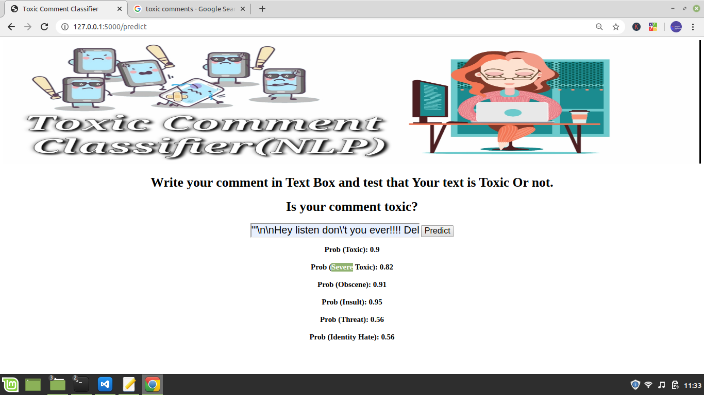
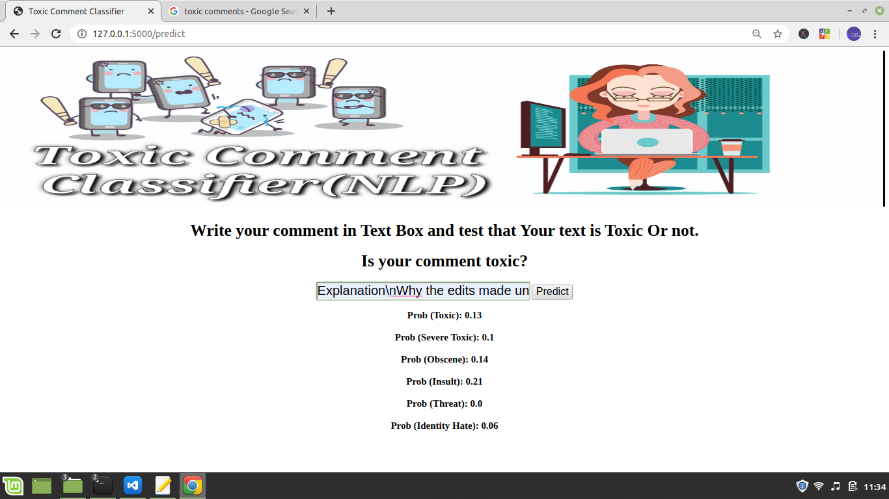

# Toxic comment classification.

# Problem Statement
Everyday while surfing the social media we encounter a lot of comments, reviews, tweets etc. that we believe might hurt the sentiments of the people of a particular group or a community. These comments are believed to be toxic in nature, which thus defines the problem that we are trying to solve with this project i.e Classifying the comments on the social media into various categories of toxicity, which are - Toxic, Severe-toxic, Obscene, Threat, Insult, Identity_hate. This is a Multi Label Classification problem which means that a given comment may belong to more than one category at the same time.Currently I am  Working as a Machine learnig Aplication developer intern at Technocolabs

# Overview
In this notebook, we'll be developing a model that can classify string comments based on their toxicity:

* toxic
* severe_toxic
* obscene
* threat
* insult
* identity_hate

#  Language and Libraries used.

* Python 3.7
* Numpy
* Pandas
* Matplotlib
* NLTK
* Seaborn

# Run Locally
* Build the Model
* Deploy the Model
* Use the Model
* Development
* Cleanup

click here to run online:-  https://toxic-comment-classifier-f-app.herokuapp.com/

# Steps involved

* Getting the dataset
* Getting insights from dataset using visualisation tools.
* Preprocessing the data using NLTK.
* Applying Multi Label classification algorithms.
* Comparing the results and choosing the best among them.
* Results
* Predicted an accuracy score of 86.16% using Binary Relevance method with SVM classifier.

# Dataset
We use the Wikipedia comments dataset provided by Kaggle here. It consists of 159,571 instances categorized by humans to be toxic, severely toxic, threatening, obscene, insulting, and hateful.
* train.csv, test.csv, and sample_submission.csv found here. Download to /data.
* FastText embeddings found here. Download to /data.

## A brief definition of the six different toxicity types can be found below.
* Toxic: very bad, unpleasant, or harmful

* Severe toxic: extremely bad and offensive

* Obscene: (of the portrayal or description of sexual matters) offensive or disgusting by accepted standards of morality and decency

* Threat: a statement of an intention to inflict pain, injury, damage, or other hostile action on someone in retribution for something done or not done

* Insult: speak to or treat with disrespect or scornful abuse

* Identity hate: hatred, hostility, or violence towards members of a race, ethnicity, nation, religion, gender, gender identity, sexual orientation or any other designated sector of society

# About

Multilabel classification of comments based on their toxicity.

# Topics
python3 machine-learning naive-bayes-classification multilabel-classification matplotlib svm-classifier toxic-comment-classification
Resources

# References

J. Devlin, M. Chang, K. Lee, K. Toutanova, BERT: Pre-training of Deep Bidirectional Transformers for Language Understanding, arXiv, 2018.
* Google BERT repository
* Huggingface BERT Pytorch repository
* Multi-Label Text Classification using BERT - The Mighty Transformer
* Kaggle Toxic Comment Classification
